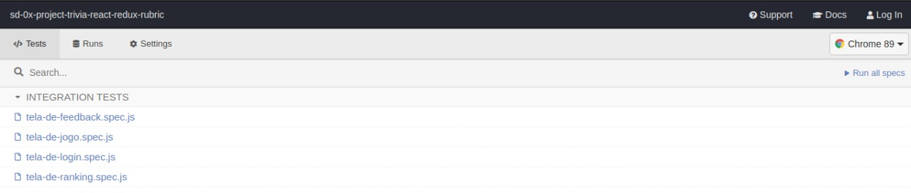

# Boas-vindas ao repositório do projeto Star Wars Planets Search!


## O que foi desenvolvido 👨‍💻 

  Uma lista com filtros de planetas do universo de Star Wars usando **Context API e Hooks** para controlar os estados globais.

  Nesse projeto utilizei:

  * _Context API_ do **React** para gerenciar estado.
  * _React Hook useState_;
  * _React Hook useContext_;
  * _React Hook useEffect_;
  * _React Hooks_ customizados.
  *  _Jest_

## Instruções para rodar o projeto <a name="instrucoes"></a>

     
  - Clone o repositório com o comando **git clone**:
  
        git clone git@github.com:luizfilipelgs/StarWars_Planets.git
  
  - Entre no diretório que acabou de criar:

        cd StarWars_Planets
        
  - Para o projeto funcionar na sua máquia, será necessário instalar suas dependências, para isso, utilize **npm install**:

        npm install

## Orientações

<details>
  <summary><strong>🎛 Linter</strong></summary><br />

  Para garantir a qualidade do seu código de forma a tê-lo mais legível, de mais fácil manutenção e seguindo as boas práticas de desenvolvimento nós utilizamos neste projeto o linter `ESLint` e o `Stylelint`. Para rodar o linter localmente em seu projeto, execute o comando abaixo:

  ```bash
  npm run lint
  npm run lint:styles
  ```
</details>

<details>
  <summary><strong>🛠 Testes</strong></summary><br />

* <details><summary><b> Execução de testes de requisito</b></summary>

  Os testes deste projeto foram feitos utilizando o [Cypress](https://www.cypress.io/how-it-works/). É utilizada nos testes a resolução `1366 x 768` (1366 pixels de largura por 768 pixels de altura) para testes de layout. Logo, recomenda-se desenvolver seu projeto usando a mesma resolução, via instalação [deste plugin](https://chrome.google.com/webstore/detail/window-resizer/kkelicaakdanhinjdeammmilcgefonfh?hl=en) do `Chrome` para facilitar a configuração dessa resolução, por exemplo.

  Para o projeto ser validado, todos os testes de comportamento devem passar. É possível testar isso local rodando `npm run cy`. Esse comando roda a suite de testes do Cypress que valida se o fluxo geral e os requisitos funcionais estão funcionando como deveriam. Você pode também executar o comando `npm run cy:open` para ter um resultado visual dos testes executados.

  Esses testes não consideram o layout de maneira geral, mas sim os atributos e informações corretas, então preste atenção nisso! Os testes te darão uma mensagem de erro caso não estejam passando (seja qual for o motivo). 😉
  </details>

* <details><summary><b> Execução de um teste específico</b></summary>

  Para executar somente uma `spec` de testes, você pode selecionar qual delas você deseja após executar o comando `npm run cy:open`. Além disto você pode rodar todas as `specs` clicando no botão `Run all specs`.

  

  **Atenção:** Sua aplicação deve estar rodando para o Cypress no terminal poder testar.
  </details>

* <details><summary><b> Execução de teste de cobertura</b></summary>

  Alguns requisitos irão pedir para que você desenvolva testes para sua aplicação. Esses testes serão avaliados através da cobertura de testes.

  É possível verificar o percentual da cobertura de testes com o comando `npm run test-coverage`.

  Você também pode executar `npm run test-coverage -- --collectCoverageFrom=caminho/da/Pagina` para verificar o percentual de cobertura de testes de cada 'Pagina'. Por exemplo, para verificar a cobertura de testes da página de `Login`, execute o comando `npm run test-coverage -- --collectCoverageFrom=src/pages/Login.js`.
  </details><br />
</details>

## Requisitos

<details><summary><strong>Checklist</strong></summary>

- [x] 1. 
- [x] 2. 
- [x] 3.
- [x] 4. 
- [x] 5.
- [x] 6. 
- [x] 7. 
- [x] 8. 
- [ ] 9. 
- [x] 10. 

  </details><br />

## 1 - Faça uma requisição para o endpoint `/planets` da API de Star Wars e preencha uma tabela com os dados retornados, com exceção dos dados da coluna `residents`

<details><summary> Ilustração da tabela:</summary>

  
</details><br />

<details><summary> A tabela deve ser renderizada por um componente chamado <code>Table</code>:</summary>

  - Você deve apagar a coluna `residents` de cada planeta antes de salvar os dados recebidos da API no contexto.
  - A requisição deve ser feita em um componente separado do componente da tabela.
  - A API a ser consultada está [nesse link](https://swapi.dev/api/planets). Você deverá fazer um fetch para a URL `https://swapi.dev/api/planets`.
  - A primeira linha da tabela deve conter os headers de cada coluna. As demais linhas serão as informações de cada planeta recebido da API.
</details>

---

## 2 - Crie um filtro de texto para a tabela
<details><summary> A tabela deve ser atualizada com os planetas que se encaixam no filtro à medida que o nome é digitado, sem ter que apertar em um botão para efetuar a filtragem. Por exemplo, se for digitado "Tatoo" no campo de texto, o planeta "Tatooine" deve ser exibido, como demonstrado na <b>ilustração</b>:</summary>

  
</details><br />

<details><summary>Observações técnicas</summary>

  - Você deve usar **Context API e Hooks** para fazer o gerenciamento do estado da aplicação;
  - O campo de texto deve possuir a propriedade `data-testid='name-filter'` para que a avaliação automatizada funcione;
  - <details><summary> O texto digitado deve ser salvo num campo <code>{ filterByName: { name } }</code>. Por exemplo:</summary>

    ```javascript
    {
      filterByName: {
        name: 'Tatoo'
      }
    }
    ```
  </details>
</details>

---

## 3 - Crie um filtro para valores numéricos

<details><summary> O filtro funcionará com três seletores:</summary>

  - O primeiro deve abrir um dropdown que permita a quem usa selecionar uma das seguintes colunas: `population`, `orbital_period`, `diameter`, `rotation_period` e `surface_water`. Deve ser uma tag `select` com a propriedade `data-testid='column-filter'`;
  - O segundo deve determinar se a faixa de valor será `maior que`, `menor que` ou `igual a` o numero que virá a seguir. Uma tag `select` com a propriedade `data-testid='comparison-filter'`;
  - O terceiro deve ser uma caixa de texto que só aceita números. Essa caixa deve ser uma tag `input` com a propriedade `data-testid='value-filter'`;
  - Deve haver um botão para acionar o filtro, com a propriedade `data-testid='button-filter'`
</details>

<details><summary> A combinação desses três seletores, ao clicar no botão, deve filtrar os dados da tabela de acordo com a coluna correspondente e com os valores escolhidos. Por exemplo:</summary>

  - A seleção `population | maior que | 100000` - Seleciona somente planetas com mais de 100000 habitantes.
  - A seleção `diameter | menor que | 8000` - Seleciona somente planetas com diâmetro menor que 8000.
</details>

<details><summary><b>Ilustração do filtro:</b></summary>

  
</details><br />


<details><summary>Observações técnicas</summary>

  * Você deve usar **Context API e Hooks** para fazer o gerenciamento do estado da aplicação;
  * <details><summary> No contexto, esses valores devem ser salvos em um outro campo <code>{ filterByNumericValues: [{ column, comparison, value }] }</code>. Por exemplo:</summary>

    ```javascript
    {
      filterByNumericValues: [
        {
          column: 'population',
          comparison: 'maior que',
          value: '100000',
        }
      ]
    }
    ```
</details>

---

## 4 - Implemente múltiplos filtros numéricos

<details><summary> Deverá ser possível adicionar múltiplos filtros numéricos. Todos os filtros adicionados devem funcionar de forma conjunta:</summary>

  
</details><br />

---

## 5 - Desenvolva testes para atingir 30% de cobertura total da aplicação

<details><summary>Observações técnicas</summary>

  * Os testes criados por você não irão influenciar os outros requisitos no avaliador. Você deverá desenvolver seus testes unitários/integração usando a biblioteca React Testing Library, enquanto o avaliador usará a biblioteca [Cypress](https://docs.cypress.io/) para avaliar os requisitos, inclusive os de cobertura.
</details><br />

---

## 6 - Não utilize filtros repetidos

<details><summary> Caso um filtro seja totalmente preenchido, um novo filtro de valores numéricos deve ser carregado.</summary>

  * Este novo filtro não deve incluir quaisquer colunas que já tenham sido selecionadas em filtros de valores numéricos anteriores;
  * Caso todas as colunas já tenham sido inclusas em filtros anteriores, não deve ser carregado um novo filtro;
  * Você deve usar **Context API e Hooks** para fazer o gerenciamento do estado da aplicação.
</details>

<details><summary> Ilustração:</summary>

  
</details><br />

---

## 7 - Apague um filtro de valor numérico ao clicar no ícone `X` de um dos filtros e apague todas filtragens numéricas simultaneamente ao clicar em outro botão de `Remover todas filtragens`

* <details><summary> O <code>button</code> que permite exclusão de um filtro deve existir em todos os filtros de valores numéricos:</summary>

  - Cada linha que demonstra o filtro já utilizado deve possuir a propriedade `data-testid='filter'`, com um `button` que deve ser filho direto da tag onde foi utilizado o `data-testid='filter'`;
  - Após a exclusão, a coluna que este filtro selecionava deve passar a ficar disponível nos dropdowns dos demais filtros já presentes na tela;
  - Você deve usar **Context API e Hooks** para fazer o gerenciamento do estado da aplicação.
  - <details><summary> Exemplo:</summary>

    ```html
    data-testid='filter'
        ⬑ column
        ⬑ comparison
        ⬑ value
        ⬑ button
    ```
  </details>
</details>


* O `button` de `Remover todas filtragens` deverá possuir o `data-testid='button-remove-filters'`. Este `button` será responsável pela remoção de todos os filtros numéricos simultaneamente.

<details><summary> Ilustração do requisito:</summary>

  
</details>

---

## 8 - Desenvolva testes para atingir 60% de cobertura total da aplicação

<details><summary>Observações técnicas</summary>

  * Os testes criados por você não irão influenciar os outros requisitos no avaliador. Você deverá desenvolver seus testes unitários/integração usando a biblioteca React Testing Library, enquanto o avaliador usará a biblioteca [Cypress](https://docs.cypress.io/) para avaliar os requisitos, inclusive os de cobertura.
</details><br />

---

# Requisito Bônus

## 9 - Ordene as colunas de forma ascendente ou descendente

* A ordenação deve ser feita via filtro: um dropdown selecionará a coluna a basear a ordenação e um par de radio buttons determinará se é ascendente ou descendente.

* <details><summary> A informação acerca da ordenação das colunas deve ser armazenada em um novo campo <code>{ order: { column: 'population', sort: 'ASC'} }</code>:</summary>

  - O campo `column` representa o nome da coluna a ordenar;
  - O campo `sort` representa a ordenação, sendo 'ASC' ascendente e 'DESC' descendente;
</details>

* <details><summary> O dropdown deve ser um elemento <code>select</code>:</summary>

  - O `dropdown` precisa ter a propriedade `data-testid='column-sort'`;
  - <details><summary> As colunas selecionáveis através deste <code>dropdown</code> são:</summary>

    - 'population';
    - 'orbital_period';
    - 'diameter';
    - 'rotation_period';
    - 'surface_water'.
    </details>
</details>

* <details><summary> É necessário ter dois <code>inputs</code> de tipo <code>radio</code>:</summary>

  - O primeiro deve possuir o atributo `data-testid='column-sort-input-asc'` e `value` sendo `ASC`;
  - O segundo deve possuir o atributo `data-testid='column-sort-input-desc'` e `value` sendo `DESC`;
</details>

* :eyes: Caso a coluna ordenada possua planetas com valores `unknown`, você deverá ordená-los de forma que valores `unknown` ficarão em último lugar na ordenação.

* Por fim, crie um botão para submeter a ordenação, com uma tag `button` e a propriedade `data-testid='column-sort-button'`.

* Adicione o atributo `data-testid` com o valor `planet-name` em todos os elementos da tabela que possuem o nome de um planeta.

<details><summary><b> Ilustração do requisito:</b></summary>

  
</details>

---

## 10 - Desenvolva testes para atingir 90% de cobertura total da aplicação

<details><summary>Observações técnicas</summary>

  * Os testes criados por você não irão influenciar os outros requisitos no avaliador. Você deverá desenvolver seus testes unitários/integração usando a biblioteca React Testing Library, enquanto o avaliador usará a biblioteca [Cypress](https://docs.cypress.io/) para avaliar os requisitos, inclusive os de cobertura.
</details><br />

